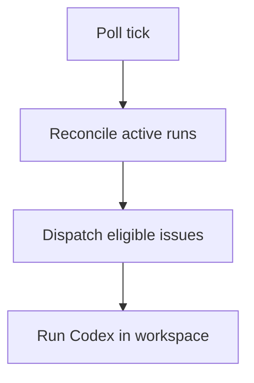
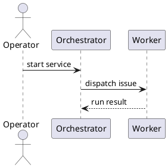

# Project Memory

## Current System

- `basic-memory` is the current source of truth for durable project memory.
- Use it for architecture notes, workflow decisions, debugging discoveries, operating procedures, and other information that should survive across sessions and tools.
- Agent-local memory systems may exist, but they should be treated as caches or convenience layers.
- The memory system should stay token-efficient: short summaries, focused notes, and filterable metadata.
- Default implementation context should assume `arpego/` + `libretto/` + `scripts/` unless a note explicitly says it is about the legacy `elixir/` reference tree.
- OpenSpec workflow knowledge belongs here too: proposal patterns, spec decisions, verification lessons, and archive/sync conventions.

## OpenSpec Philosophy

- fluid, not rigid
- iterative, not waterfall
- easy, not complex
- built for brownfield, not just greenfield
- scalable from personal projects to enterprises

## OpenSpec Workflow Memory

When a pattern is reusable across changes, record it in project memory instead of relying on chat:

- how we write proposals in this repo
- how we structure specs for brownfield changes
- design tradeoffs that recur
- implementation checklist patterns
- verification habits
- archive and spec-sync practices

Default OpenSpec flow:

1. `/opsx:propose "idea"`
2. `/opsx:apply`
3. `/opsx:archive`

Prefer memory entries that summarize reusable lessons from completed OpenSpec changes rather than
copying whole change folders into memory.

## Content Format

- Store memory as Markdown documents.
- Add YAML front matter when notes need metadata, tags, owners, dates, status, or other filterable fields.
- Prefer YAML front matter over TOML for memory and specs because YAML is better for nested metadata, lists, and multiline text.
- Use TOML only for runtime or tool configuration.
- Use metadata fields that support retrieval, such as `area`, `component`, `language`, `framework`, `service`, `status`, and `tags`.

Example:

```md
---
title: Orchestrator retry behavior
type: architecture-note
area: orchestrator
component: scheduler
language: go
service: symphony
status: active
tags:
  - retries
  - reconciliation
  - scheduler
updated: 2026-03-06
---

# Orchestrator retry behavior

...
```

## Diagram Conventions

- Use Mermaid by default for diagrams in docs and memory notes.
- Use PlantUML when Mermaid is too limited, especially for detailed sequence diagrams, class diagrams, or deployment views.
- Keep diagrams adjacent to the note they explain.

## Retrieval Rules

- Keep notes small and topic-focused.
- Put a short summary at the top so agents can stop after the first screen when appropriate.
- Avoid repeating the same knowledge across multiple notes.
- If a note is language- or stack-specific, tag it explicitly so retrieval can filter to the right implementation context.

Mermaid example:



PlantUML example:


